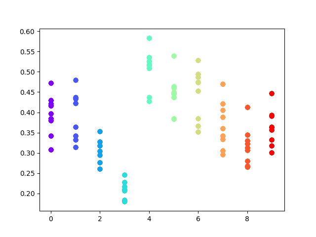
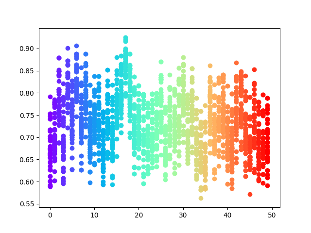

# Number Game
This framework includes two players, a sender and a receiver.

## Game 1
In this game, the sender is given two n-dim one-hot vectors and a target(left/right): (vL, vR, t), t in {vL, vR}.

The sender need to send a real number to the receiver, we call this the sender's policy: s(vL, vR, t).

The receiver does not know the target, but sees the sender's value, the shuffled ont-hot vectors and tries to guess the target, we call this the receiver's policy r(vL', vR', s(vL, vR, t)) \in {vL, vR}. (the vectors must be shuffled before sent to receiver because we need to prevent the situation that s(vL, vR, t) indicates whether to choose left or right).

If r(vL', vR', s(vL, vR, t)) = t, both players receive a payoff of 1, otherwise, they receive a payoff of 0.

# Algorithm
We adopt the same algorithm as the one in [Multi-Agent Cooperation and the Emergence of (Natural) Language](https://arxiv.org/pdf/1612.07182.pdf).

Note that the sender's policy is a real number, Deterministic Policy Gradient is required to learn the policy, in which we need the gradient of Q-function. To address this problem, we build an extra Critic network to fit the Q-function.

# Result
## Real value representation of one-hot vectors
n = 10

n = 50

